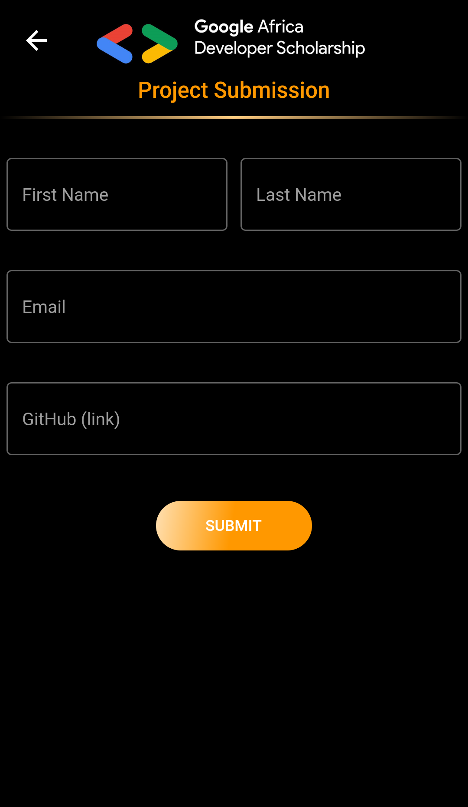

# Google Africa Developer Scholarship Phase II 

## Associate Android Developer Practice Project

[Building a GADS Leaderboard Mobile Application](https://docs.google.com/document/d/1KS003bk1a-2bOfUnhXvnOPoHfPuKtdkTAQ_APljjgWc/edit).

## Screenshots

    
    
    
    
    
    

